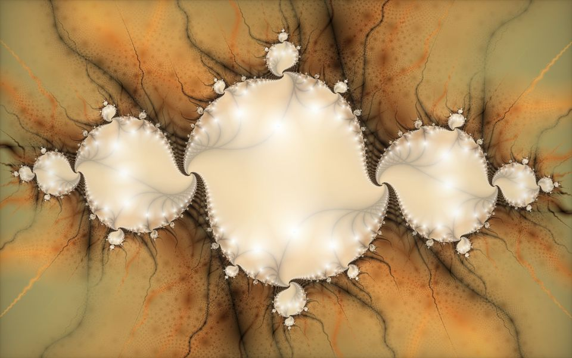
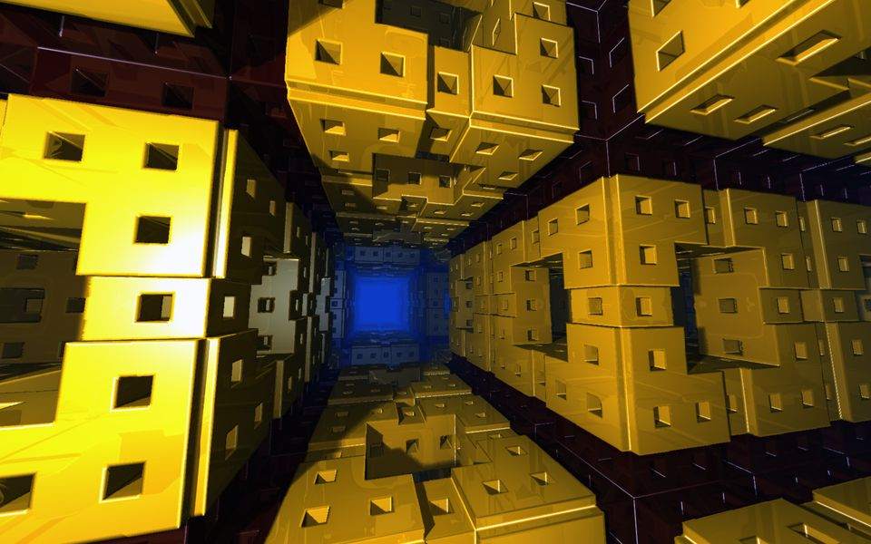

# Tiny in size, strong in view

Some tiny apps (like ~100kB executable file) showing some GFX.

## Julia
Julia set, colored with orbit traps, animating and exploring *c* parameter of Julia's equation.
Press [ESC] to quit.

## Menger Tour
Menger sponge. The idea and general code taken from [Shane](https://www.shadertoy.com/view/ldyGWm).
Some rendering tricks taken from master [Inigo Quilez](https://iquilezles.org/).

